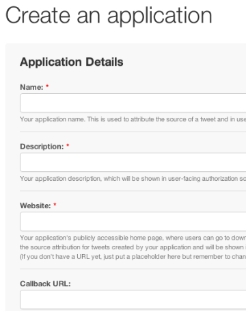
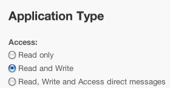
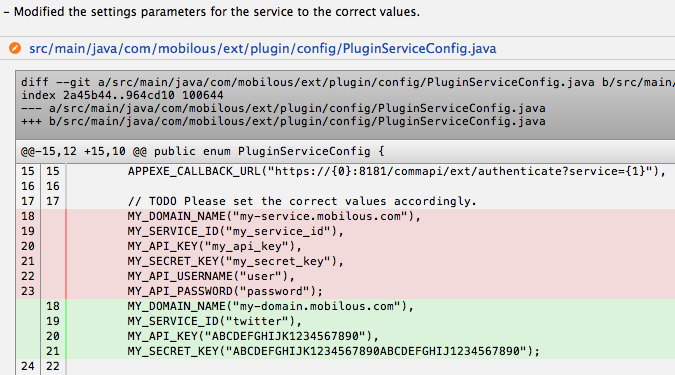

Creating a Plugin
=================

Introduction
------------

This post provides a quick starting guide for creating a plugin to
communicate with AppExe external service module.

Pre-requisites
--------------

This guide assumes basic familiarity with the following concepts and
frameworks -- `Maven <http://maven.apache.org>`_,
`OAuth <http://oauth.net>`_ and `Spring
Social <http://www.springsource.org/spring-social>`_.

The Steps
---------

1. Create an application with the service provider.
~~~~~~~~~~~~~~~~~~~~~~~~~~~~~~~~~~~~~~~~~~~~~~~~~~~

Each service provider will have their own sites where you can create an
application, e.g. `Twitter <https://dev.twitter.com/apps>`_ or
`Facebook <https://developers.facebook.com/apps>`_.

   Create application page for Twitter

You will be asked to enter some information about the app, such as
application name and description, your company's website and a callback
URL. For the callback URL, please use the following format:

::

    https://<domain_name>:8181/commapi/extsvc/authenticate?servicename=<service_id>

NOTES:

-  The domain name refers to the domain name where your application is
   hosted.
-  The service ID will be used by the AppExe main system to identify
   your plugin. Please choose a name that is unique for that domain. You
   may re-use the same name if you intend to use the same plugin in a
   different domain.

Once created, you will be presented with a few settings parameters.
Generally, the plugin will only use three parameters, namely, **API
key**, **API secret** and **callback URL**. Note that different service
providers may use different terms for the parameters, but they basically
refer to the same things.

2. Modify the access/permission level for the application.
~~~~~~~~~~~~~~~~~~~~~~~~~~~~~~~~~~~~~~~~~~~~~~~~~~~~~~~~~~

Each newly-registered application is typically assigned a basic
permission level on what kind of information that it is allowed to
access. If you need additional permissions, such as posting to the
timeline or uploading images, then you will need to modify the
permission settings accordingly.

   Application access level for Twitter

3. Clone the plugin template.
~~~~~~~~~~~~~~~~~~~~~~~~~~~~~

We have created a `plugin
template <https://github.com/mobilousinc/appexe-commapi-ext-plugin>`_
that you can use as a starting point. The template is created as a Maven
project and can be imported to your favourite Java IDE easily.

The template consists of the following classes/interfaces:

1. **PluginService**: the interface that defines the methods that need
   to be implemented.
2. **PluginServiceConfig**: contains the settings parameters required to
   gain access to the service provider.
3. **PluginServiceImpl**: contains the main implementation for the
   communication with the service provider.
4. **Schema**: defines the database schema for the service.
5. **Constant**: contains the constants that are recognised by the
   AppExe system.
6. **DatasetKey**: contains the dataset keys that are recognised by the
   AppExe system.
7. **DataType**: contains the five data types that are recognised by the
   AppExe system.
8. **HeterogeneousMap**: basically a cleaner-looking version of
   Map<String, Object>.

From the classes/interfaces listed above, you would only need to modify
three of them: **PluginServiceConfig**, **Schema** and
**PluginServiceImpl** to get a working plugin, as described below.

4. Modify the Project Object Model (POM).
~~~~~~~~~~~~~~~~~~~~~~~~~~~~~~~~~~~~~~~~~

The Maven POM is an XML file that contains information about the project
and configuration details used by Maven to build the project.

The resulting build (JAR file) is the plugin itself. The file will be
named after the artifact ID, so it may be a good idea to rename it to a
name that matches the service name.

For example, from

::

    <artifactId>appexe-commapi-ext-plugin</artifactId>

to

::

    <artifactId>appexe-commapi-ext-plugin-twitter</artifactId>

While it it is definitely possible to write your own methods to access
the external service APIs, the team at Spring Source has created the
`Spring Social <http://www.springsource.org/spring-social>`_ extension
that allows for access to the external services via various third party
libraries. We encourage the plugin developers to make use of those
libraries.

5. Modify the plugin configuration in PluginServiceConfig.
~~~~~~~~~~~~~~~~~~~~~~~~~~~~~~~~~~~~~~~~~~~~~~~~~~~~~~~~~~

Enter the settings parameters of the application that you just created.

::

    MY_DOMAIN_NAME("my-service.mobilous.com"),
    MY_SERVICE_NAME("my_service_name"),
    MY_API_KEY("my_api_key"),
    MY_SECRET_KEY("my_secret_key")

NOTES:

-  The domain name and the service ID must be the same as the ones that
   you defined in the callback URL above.
-  The callback URL in PluginServiceConfig has been formatted to take in
   the values defined above. Please do not modify it unless you are sure
   of what you are doing.

6. Define the database schema in Schema.
~~~~~~~~~~~~~~~~~~~~~~~~~~~~~~~~~~~~~~~~

The plugin treats the contents from the external service as a collection
of data items contained in a relational database. Therefore, it is
essential to map them into database tables and fields. They have been
defined as Java enums in the Schema class to make it easier to reference
from other classes.

::

    public enum Table {
        TABLE_01("table_01_name", table01Schema),
        TABLE_02("table_02_name", table02Schema)
        ...

    }

    public enum Field {
        FIELD_01("field_01"),
        FIELD_02("field_02")
        ...

    }

    private static final HeterogeneousMap table01Schema;
    static {
        List<String> booleanFields = Arrays.asList(Field.FIELD_01.getValue());
        List<String> dateFields = Arrays.asList(Field.FIELD_02.getValue());
        List<String> integerFields = Arrays.asList(Field.FIELD_03.getValue());
        List<String> realFields = Arrays.asList(Field.FIELD_04.getValue());
        List<String> textFields = Arrays.asList(Field.FIELD_05.getValue());

        HeterogeneousMap schema = new HeterogeneousMap();
        schema.put(DataType.BOOLEAN.getValue(), booleanFields, List.class);
        schema.put(DataType.DATE.getValue(), dateFields, List.class);
        schema.put(DataType.INTEGER.getValue(), integerFields, List.class);
        schema.put(DataType.REAL.getValue(), realFields, List.class);
        schema.put(DataType.TEXT.getValue(), textFields, List.class);

        table01Schema = schema;
    };

    ...

7. Write the implementation in PluginServiceImpl.
~~~~~~~~~~~~~~~~~~~~~~~~~~~~~~~~~~~~~~~~~~~~~~~~~

There are currently seven methods that need to be implemented:

1. **getServiceName**: set the service name and authorization URL. This
   will be used by AppExe Console to retrieve the schema via the service
   API. Leave the authorization as "null" if the schema is defined by
   the plugin developers themselves.
2. **authenticate**: perform authentication with the service provider to
   gain access to protected areas.
3. **getSchema**: obtain a representation of the collection of data
   items as a relational database.
4. **create**: create new content.
5. **read**: retrieve existing contents.
6. **update**: modify existing contents.
7. **delete**: delete existing contents.

Plugin Sample
-------------

To better help plugin developers understand how to build on the
template, we have created a `sample plugin for Twitter
service <https://github.com/mobilousinc/appexe-commapi-plugin-twitter-sample>`_.
The sample plugin demonstrates how to implement the OAuth
authentication, retrieve user's recent tweets, post a tweet and delete a
tweet.

The sequence of the Git commits follows closely the steps described
above. You may want to use a `GUI-based Git
client <http://git-scm.com/downloads/guis>`_ to have a better
visualisation on how the source code evolves with each commit.

   Changes made to a source file as shown on GitX (L)

Note on HeterogeneousMap
~~~~~~~~~~~~~~~~~~~~~~~~

As described above, HeterogeneousMap is basically a cleaner-looking
version of Map<String, Objects>. The data type of the values is passed
as an argument when adding and retrieving them, for example:

::

    map.put(key, arrayA, List.class);

    List arrayA = map.get(key, List.class);

Since most values are generally of data type String, these values can be
added or retrieved without specifying it as a String:

::

    map.put(key, stringA);

    String stringA = map.get(key);

authenticate
~~~~~~~~~~~~

The first and most important method to implement is the **authenticate**
method. The objective is to obtain some kind of login credentials that
can be used to access protected areas of the service.

The Twitter sample plugin shows the implementation of `OAuth
1.0 <https://dev.twitter.com/docs/auth/oauth>`_, which involves two
steps, namely, accessing the website via an **authorize\_url** to obtain
an **oauth\_verifier**, which can subsequently be exchanged for an
**access token**, which is the login credential that we are looking for.

::

    HeterogeneousMap retVal = new HeterogeneousMap();
    if (dataset.get("oauth_verifier") == null) {
        OAuth1Operations oauthOperations = connectionFactory.getOAuthOperations();
        OAuthToken requestToken = oauthOperations.fetchRequestToken(callbackURL, null);

        retVal.put("request_token", requestToken, OAuthToken.class);
        retVal.put("authorize_url", oauthOperations.buildAuthorizeUrl(requestToken.getValue(), OAuth1Parameters.NONE));
    } else {
        OAuthToken requestToken = dataset.get("request_token", OAuthToken.class);
        String oauthToken = dataset.get("oauth_verifier");
        OAuth1Operations oauthOperations = connectionFactory.getOAuthOperations();
        OAuthToken accessToken = oauthOperations.exchangeForAccessToken(new AuthorizedRequestToken(requestToken, oauthToken), null);

        retVal.put("auth_type", "OAuth1");
        retVal.put("user_connection", accessToken, OAuthToken.class);
    }

    return retVal;

The sample uses the `Twitter
module <http://static.springsource.org/spring-social/docs/1.0.x/reference/html/serviceprovider.html>`_
from the Spring Social project, which simplifies the implementation
greatly by delegating the HTTP request-response handling to the Twitter
module.

getSchema
~~~~~~~~~

This is the method that is used by the AppExe main system in order to
obtain a representation of the collection of data items as a relational
database.

create, read, update and delete (CRUD)
~~~~~~~~~~~~~~~~~~~~~~~~~~~~~~~~~~~~~~

These are the methods for accessing the contents on the service
provider. Using the Twitter sample again, the typical procedure is to
use the **access token** that we obtained from the authentication method
above, and use it to create a connection with the service provider.
Using the connection, we can instantiate the object that we can use to
perform various API calls to the service provider.

::

    OAuthToken accessToken = dataset.get(DatasetKey.ACCESS_TOKEN.getKey(), OAuthToken.class);
    Connection<Twitter> connection = connectionFactory.createConnection(accessToken);
    Twitter twitter = connection.getApi();

References
----------

-  `Java Simple Plugin Framework <https://code.google.com/p/jspf/>`_
-  `Spring Social \|
   SpringSource.org <http://www.springsource.org/spring-social>`_

